# AR Grocery Shopping Companion

## Abstract
Although online shopping is growing tremendously, many customers still prefer to do their grocery shopping in-store and choose the products in person. However, in-store shopping has its limitations, customers cannot view what others think of this product, or check its price elsewhere. Also, one of the challenges most customers face is the inability to read all the products’ details due to the small packaging. Using AR (Augmented Reality), features found in online shopping such as user reviews, price comparison, clear nutritional facts, and product alternatives, can be implemented in a real shop while holding the product in hand. The proposed system is an AR-based flutter mobile application that uses the mobile’s camera to scan the user’s environment then overlays around their product of interest all relevant information in a graphical, immersive, and user-friendly way.

## Application Overview
### System Overview
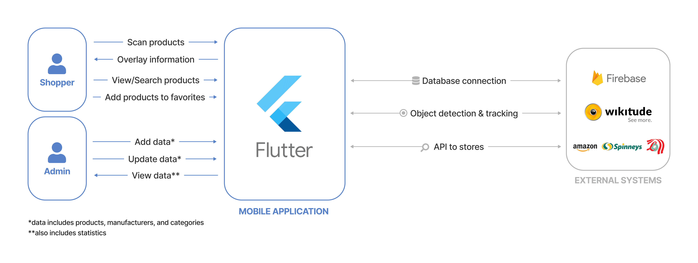

### System Context
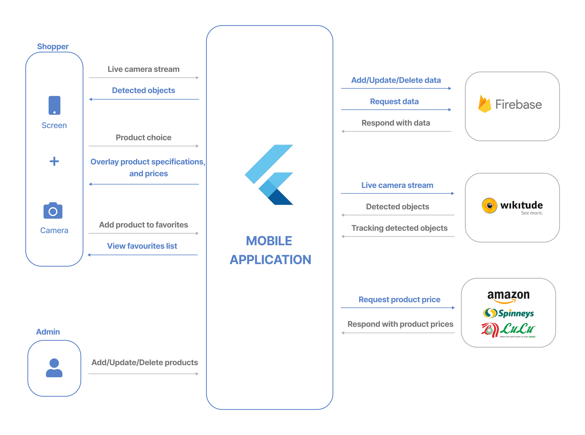

## Application User Interface
### Shopper Interface
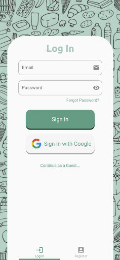 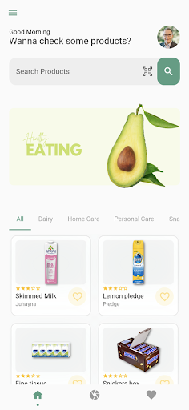 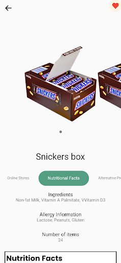
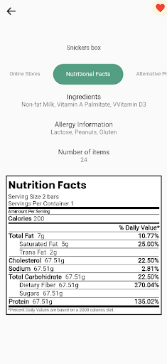  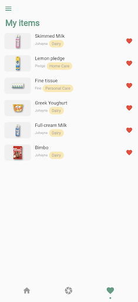

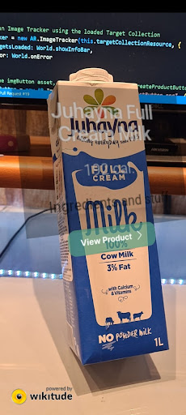 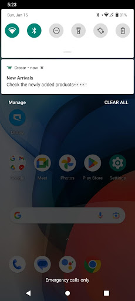

### Admin Interface
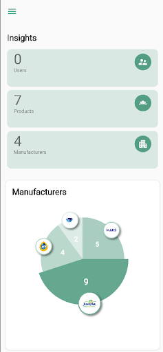 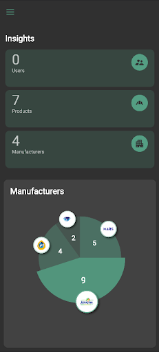
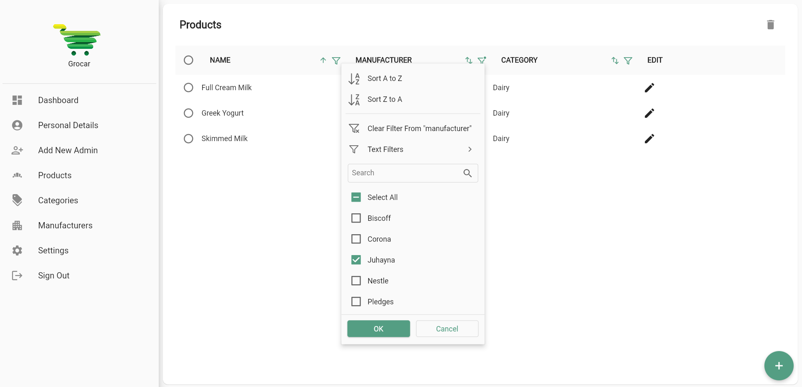
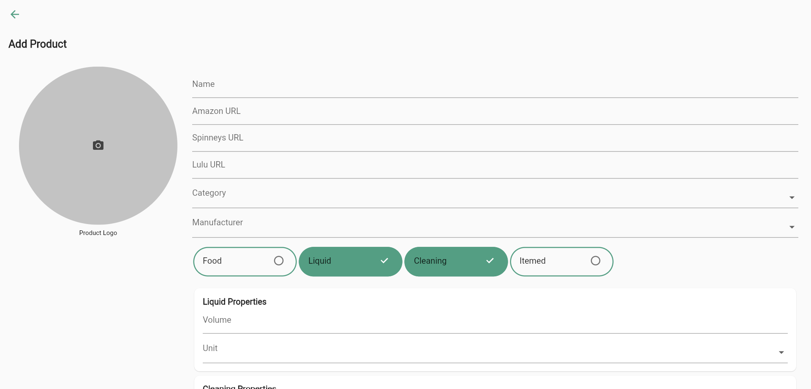